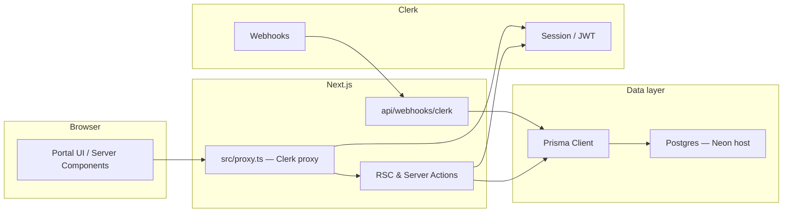

# Client portal architecture

This document maps how the signed-in client portal fits together: routing, identity, data access, and where each module lives in the codebase. **No secrets** are documented here; use [`.env.example`](../.env.example) and the project README for variable names and setup.

**Further documentation:** [Client portal user guide](./client-portal-user-guide.md) (end users), [Internal ops runbook](./internal-ops-runbook.md) (provisioning and ops), [Admin dashboard status](./admin-dashboard-status.md) (what `/admin` is vs `/portal`).

## Primary user journeys

- **Client journey:** Marketing `Client Login` -> `/sign-in` -> `/portal` workspace picker -> `/portal/[workspaceSlug]` dashboard -> module actions (`tickets`, `support`, `customization`, `monitoring`).
- **Internal LIC journey:** allowlisted team member -> `/admin` -> core ops navigation (`Dashboard`, `Clients`, `Projects`, `Invoices`), with `Leads`, `Messages`, and `Settings` treated as secondary/phase-2 surfaces.

## End-to-end request flow

Unauthenticated visitors hit marketing routes. Paths under `/portal` are protected at the edge of the Next app. Server code resolves the Clerk session, loads or upserts the app `User`, checks workspace membership, then reads or mutates data through Prisma. `DATABASE_URL` points at a Postgres instance (commonly [Neon](https://neon.tech) serverless Postgres).

- **`src/proxy.ts`**: `clerkMiddleware` with `createRouteMatcher(["/portal(.*)", "/admin(.*)"])`; calls `auth.protect()` for `/portal` and `/admin` so unauthenticated users are redirected through Clerk before RSC runs.
- **`src/lib/auth/session.ts`**: `auth()` / `currentUser()` from `@clerk/nextjs/server`, `prisma.user` upsert and lookups by `clerkUserId`.
- **`src/lib/auth/guards.ts`**: Workspace membership checks used by portal pages and server actions.
- **`src/lib/prisma.ts`**: Singleton `PrismaClient`; requires `DATABASE_URL`.

## Directory map (portal-relevant)

| Area | Path | Role |
|------|------|------|
| Portal routes | `src/app/portal/**` | Layout, workspace chooser, access states, `[workspaceSlug]` modules, internal bootstrap |
| Auth gate | `src/proxy.ts` | Protect `/portal` |
| Session & user | `src/lib/auth/session.ts` | Clerk → `User` row |
| Access control | `src/lib/auth/guards.ts`, `src/lib/auth/permissions.ts` | Workspace roles, `requireWorkspaceAccess`, etc. |
| Portal nav config | `src/lib/portal/nav.ts` | Shared module labels/paths for header tabs and dashboard cards |
| Tickets | `src/lib/tickets/ticket-mutations.ts` | Create/update tickets |
| Support | `src/lib/support/support-mutations.ts` | Threads and messages |
| Customization | `src/lib/customization/customization-mutations.ts` | Customization requests |
| Monitoring | `src/lib/monitoring/monitoring-mutations.ts` | Monitoring checks |
| Audit log | `src/lib/audit/events.ts` | `ActionEvent` writes where used |
| Schema | `prisma/schema.prisma` | Models and relations |
| Clerk webhook | `src/app/api/webhooks/clerk/route.ts` | Ingest Clerk events (e.g. user lifecycle) |
| Internal admin | `src/app/admin/**` | Agency-style dashboard UI backed by **mock data** (`src/lib/admin/mock-data.ts`) — not persisted to Prisma |
| Internal admin gate | `src/lib/auth/internal-admin.ts` | Same allowlist as bootstrap: `INTERNAL_ADMIN_CLERK_IDS` |

## Internal admin (`/admin`)

The **`/admin`** area is a **UI demo** for an internal agency dashboard (clients, projects, invoices, leads, settings). It uses **typed mock data** only; it does **not** create new Prisma tables or write to Postgres.

- **Auth:** Clerk session required (via `src/proxy.ts`). **Authorization:** `requireInternalAdmin()` in `src/lib/auth/internal-admin.ts` — only Clerk user ids listed in **`INTERNAL_ADMIN_CLERK_IDS`** may access `/admin` (same env var as `/portal/internal/workspace-bootstrap`).
- **Routes:** `src/app/admin/page.tsx` (KPIs + chart), `clients`, `projects` (Kanban + table), `invoices`, `leads` (sheet), `settings`, `messages` (stub). Shared chrome: `src/components/admin/AdminAppChrome.tsx`.
- **Shared UI:** Dashboard shell uses `dashboard-root` + CSS Module-driven shell/page styles (`src/styles/portal.module.css`) and module-based shared primitives under `src/components/ui/`.

## External systems

### Clerk

- **Identity**: Sign-in/up UI and session; `UserButton` in the portal top bar (`PortalTopbar`) and admin top bar (`AdminTopbar`).
- **App user link**: `User.clerkUserId` in Prisma matches Clerk’s `userId` from `auth()`.
- **Webhooks**: `POST /api/webhooks/clerk` verifies Svix signatures when `CLERK_WEBHOOK_SECRET` is set (see `.env.example`).

### Neon (Postgres)

- **Hosting**: Neon provides a Postgres-compatible URL; the app only sees `DATABASE_URL` through Prisma.
- **Migrations & seed**: Prisma CLI (`pnpm prisma:migrate:*`, `pnpm prisma:seed`) as documented in the README.

### Environment variables

See [`.env.example`](../.env.example) for `NEXT_PUBLIC_CLERK_PUBLISHABLE_KEY`, `CLERK_SECRET_KEY`, `DATABASE_URL`, optional webhook and internal-admin keys. The README describes local setup and granting portal access.

## Modules (one paragraph each)

### Overview

**Route:** `src/app/portal/[workspaceSlug]/page.tsx`. **Data:** `requireWorkspaceAccess` loads `Workspace` and `WorkspaceMembership`. The dashboard shows **read-only KPI counts** via Prisma (`Ticket`, `SupportThread`, `CustomizationRequest`, `MonitoringCheck`) and links into the four modules using `PORTAL_WORKSPACE_SECTIONS` from `src/lib/portal/nav.ts`.

### Tickets

**Route:** `src/app/portal/[workspaceSlug]/tickets/`. **Tables:** `Ticket` (and optional `Project` via `projectId`). **Mutations:** `src/lib/tickets/ticket-mutations.ts`.

### Support

**Route:** `src/app/portal/[workspaceSlug]/support/`. **Tables:** `SupportThread`, `SupportMessage`. **Mutations:** `src/lib/support/support-mutations.ts`.

### Customization

**Route:** `src/app/portal/[workspaceSlug]/customization/`. **Tables:** `CustomizationRequest` (and optional `Project`). **Mutations:** `src/lib/customization/customization-mutations.ts`.

### Monitoring

**Route:** `src/app/portal/[workspaceSlug]/monitoring/`. **Tables:** `MonitoringCheck` (and optional `Project`). **Mutations:** `src/lib/monitoring/monitoring-mutations.ts`.

### Audit trail

**Table:** `ActionEvent` in `prisma/schema.prisma`. **Helpers:** `src/lib/audit/events.ts` for recording notable actions where integrated.

## Workspace provisioning and readiness references

- **How workspaces are created and assigned:** see [internal-ops-runbook.md](./internal-ops-runbook.md), section **Giving a client access to `/portal`**.
- **Client-facing behavior and route expectations:** see [client-portal-user-guide.md](./client-portal-user-guide.md).
- **What is fully data-backed vs prototype status:** `/portal` is Prisma-backed; `/admin` status is documented in [admin-dashboard-status.md](./admin-dashboard-status.md).
